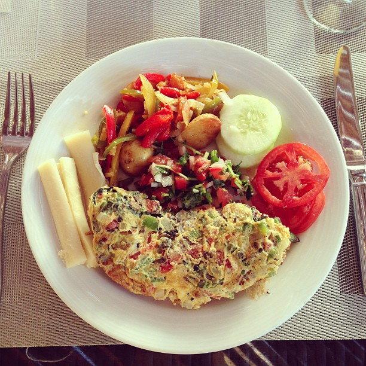
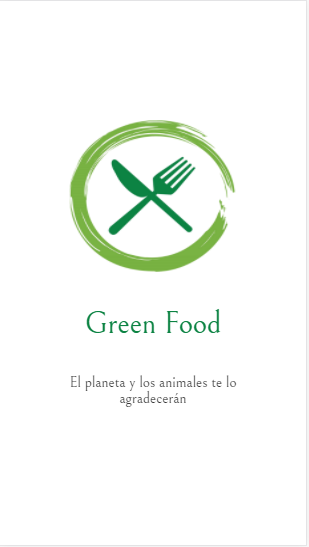

# Green Food  

Muchas veces salimos de casa con los amigos o familiares para disfrutar una agradable reunión, pero tú sabes que eres distinto a ellos. No comes carne?!.
Los problemas aparecen, no sabes que decir, ya no quieres salir, tus amistades te ven de manera diferente o ¿más bien estas pensando en cambiar tu estilo de vida? o ¿piensas en cuidar el medio ambiente?
Nosotros te traemos la solución **GREEN FOOD** no solo es una app, es todo lo que buscabas.
En  **GREEN FOOD** contarás con una cuenta personalizada, además podrás compartir tus momentos, videos, subir fotos de tu dia a dia en donde otras personas con tus mismas preferencias podrán compartirla y seguirte. Encontrarás eventos, restaurantes, alimentos, todo eso dentro de esta gran comunidad **green**.

## Vista del app
Al descargar la app podrás visualizar lo siguiente:
+ Te mostrará una vista, el nombre te cautivará  **GREEN FOOD**.
+ Luego de ello vizualizarás un inicio en donde encontrarás dos botones  **Login**  **Sign up**; si eres nuevo y quieres pertenecer a está gran comunidad, deberás requistrarte y validar todos los campos. terminada la acción tendrás que ingresar tu datos para poder darte la bienvenida y asi disfrutar de una experiencia única.

 

  

## Navegando en  **GREEN FOOD** 
En esta parte del app encontrarás todo el contenido; la comunidad, recomendaciones de los mejores restaurantes, variedades de alimentos y lo que no debe faltar los eventos, en donde podrás conocer a muchas personas.
 

    

## Diseño y elaboración
### Laura galindo
### Katherine Levano

                                  

